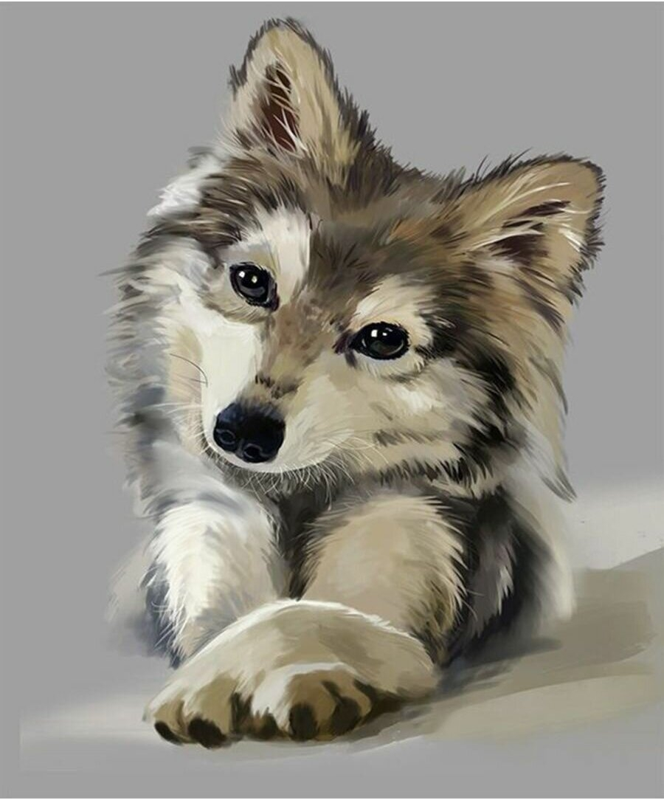

# Задание 1. Двуличная личность

## Описание

Если вы читали "Степного волка" Гессе, то наверняка помните, что главный герой - Гарри Галлер, всю свою жизнь мучился от того, что в нем уживалось две личности. Первая личность - человек, всегда стремилась к чему-то высокому, поэзии, музыке, творчеству. Вторая - волчья, к низменным вещам, природным инстиктам. 

В этой задаче нам предстоит на себе испытать, какого это - иметь две личности и при этом быть программистом.


## Условие

Итак, у вас две личности, вы программист и, вдобавок ко всему, учитесь пользоваться гитом.
Что может пойти не так?

Ниже написана последовательность действий, которые нужно сделать с репозиторием. 
В качестве решения лабы нужно в файл `commands.txt` скопировать все те команды, которые вы делали. Нужно писать только гитовые команды, команды для работы с файлами писать не нужно.

Пример файла с командами:
```
git checkout -b hello
git add 1.txt
git commit -m "my first commit"
git push
```

Файл с командами нужно закоммитать и запушить в самом конце (когда сделаете задания)

#### 1.0 Getting started

- Cклонируйте репозиторий

#### 1.1. Human side

- Cоздайте в нем ветку `human-side`

В этой ветке будет все то, что присуще человеческой натуре Гарри.

- Начнем с музыки. Добавьте коммит с файлом `bach.mp3` и сообщением `Immortal work of the immortal human`. Файл должен содержать любую композицию Баха
- Отправьте этот коммит на гитхаб
- Добавьте еще один файл с названием `wolf_quote.txt`. Добавьте туда любую цитату Вирджинии Вульф и добавьте коммит с сообщением `She is the same as me`.
- Отправьте этот коммит на гитхаб 

#### 1.2. Wolf side

- Создайте ветку `wolf-side` (перед этим не забудьте перейти на `master`, чтобы случайно не сделать волка фанатом Бетховена)

Это ветка для волчьей и низменной стороны Гарри.

- Добавьте в нее коммит с файлом `wolf_quote.txt` и сообщением `Ауф`. Файл должен содержать какую-нибудь волчью цитату 
- Добавьте вот эту картинку(она лежит в pictures/cute.jpg), сделайте с ней коммит с сообщением `Feeling cute, might delete later`:  

- Отправьте оба коммита на гитхаб
- Одумайтесь! Если оставить эту картинку в репозитории, то вас никто не станет воспринимать всерьез! Вам нужно откатить последний коммит!

*Подсказка:* один из способов откатить коммит - сделать `git reset --hard` на коммит до него (состояние вашей локальной ветки станет таким, как было до последнего коммита), а затем сделать `force-push` (меняете историю ремоут-ветки). Будьте осторожны! Никогда не делайте форс пуш на ветках, в которых работаете не только вы!

#### 1.3. Reunion

Наша история не могла закончится плохо: пройдя через все те страдания и мучения, на которые обрек волчью и человеческую личность гит, Гарри решил, что его личностям лучше работать сообща (так, по крайней мере, можно будет создавать одну ветку вместо двух 😁)

Наша задача - объединить личности Гарри.
Для этого:

- Перейдите на ветку `master` и замерджите в нее ветку `human-side` (не забудьте запушить после)
- Теперь нужно перейти на ветку `wolf-side` и заребейзить ее на свежую версию мастера
---
**Что это значит:**

- когда мы создавали ветку `wolf-side`, состояние `master` отличалось от текущего
- возможно, те изменения, которые появились в `master` после мерджа `human-side`, касаются изменений в нашей ветке
- поэтому прежде чем записывать изменения в главную ветку (`master`), мы хотим убедиться, что наши изменения в `wolf-side` все еще корректны (даже после мерджа `human-side` в `master`)
- когда мы делаем `git rebase` все коммиты в нашей ветке "переезжают" на самый верх ветки.  
*Пример:*
```
- master(initial state): commit A
- created branch wolf_side (from master, now contains commit A)
- added commits to wolf_side: commit B, commit C (now it has commits A, B, C)
- added commit to master: commit D (now it has commits A, D)
- rebasing wolf_side onto master: wolf_side now has commits A, D, B, C
```
---

Конечно, здесь не обойдется без конфликтов между двумя личностями: Гарри-человеку дорога Вирджиния Вульф, А Гарри-волку - мемасы.
Выберите сами, что вам важнее и что оставить в файле `wolf_quote.txt`. После того как закончите его редактировать, не забудьте добавить его в гит!
- Продолжите ребэйз, сообщение коммита оставьте тем же
- Сделайте `force-push` в ветку `wolf-side` (нужно переписать историю, не перепутайте ветки!)
- Перейдите на ветку `master` и замерджите в нее изменения из ветки `wolf-side`
- Отправьте результат на гитхаб

## Почему не проходит тест

Список возможных проблем, если вы добавили в `commands.txt` команды, а тест не прошел:

* лишние команды в файле (например, лишние переходы между ветками)
* нет пробелов между частями команды, например `git commit -m"my message"` не пройдет
* в командах, где нужно перечислять названия файлов, не должно быть `*` или `.`. например, `git add .` не пройдет
* опечатки в названиях веток / коммит сообщениях
* в команде, содержащей указание на предпоследний коммит, должно быть написано `HEAD~`
* команды, которые используем в лабе, должны быть из подмножества тех, что были на лекции

## Как запускать тесты локальны и смотреть их результаты
* `pip install pytest`
* `python -m pytest tests
